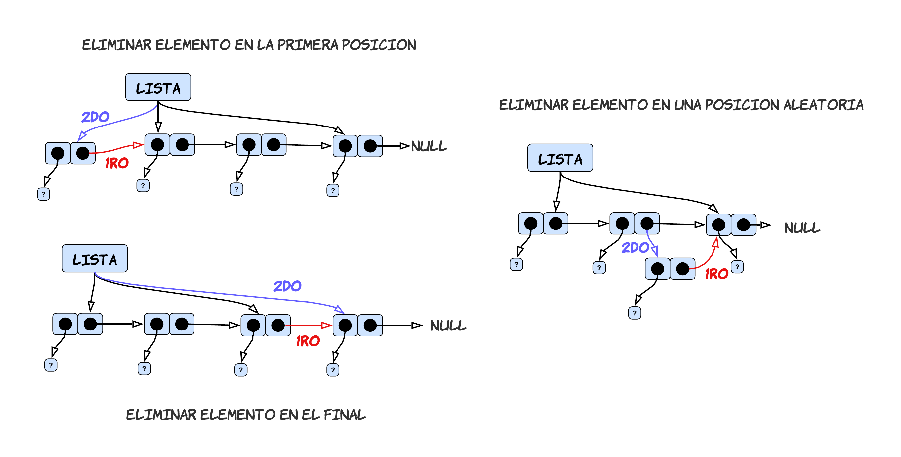
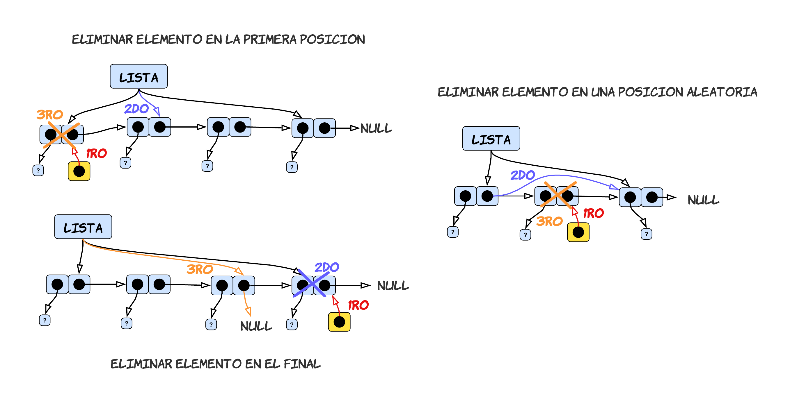
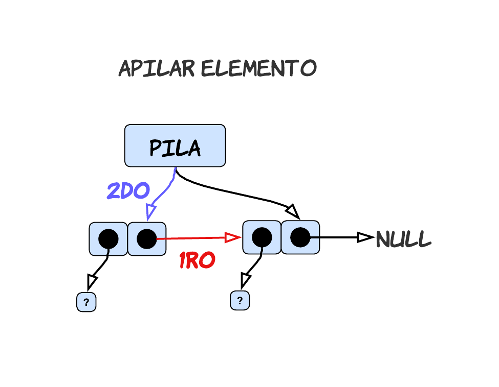
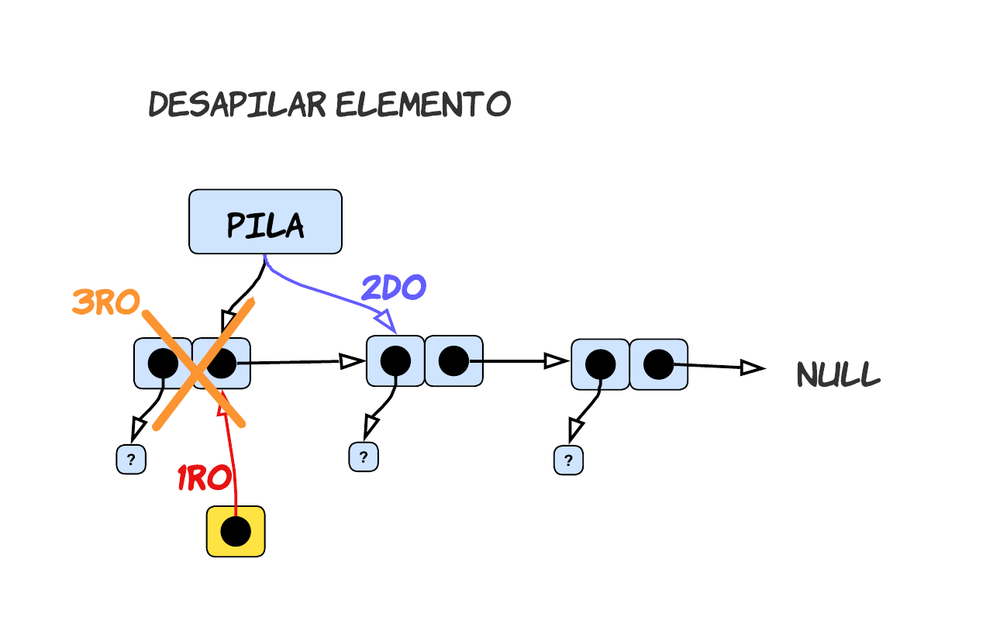
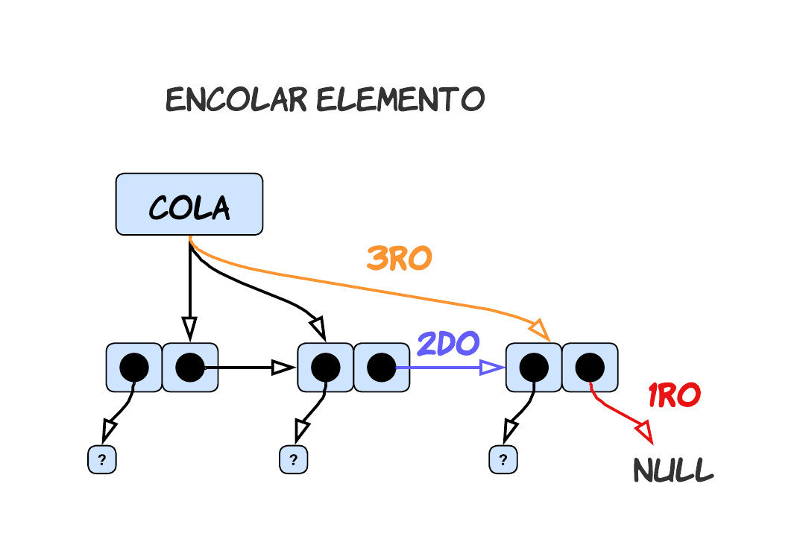
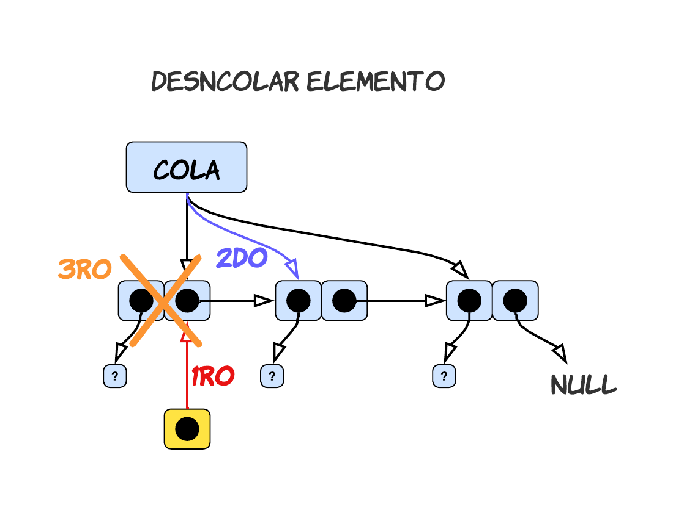
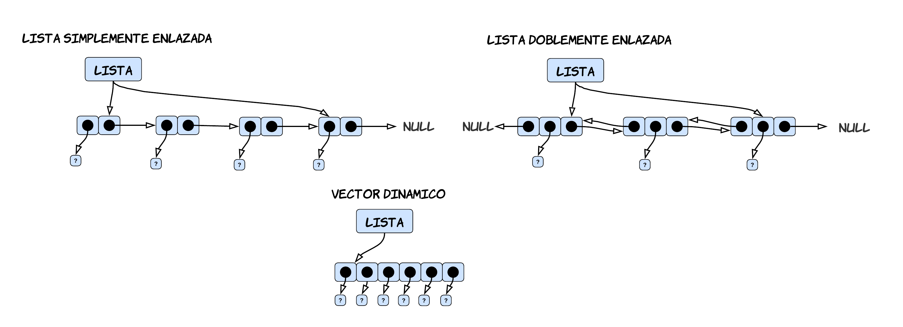
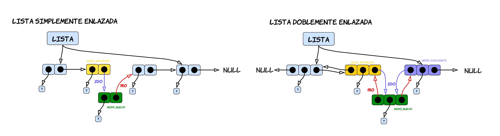

<div align="right">

</div>

# NOMBRE TP/TDA

## Repositorio de Francisco Infanti - 110822 - finfanti@fi.uba.ar

- Para compilar:

```bash
make pruebas_chanutron
```

- Para ejecutar:

```bash
./pruebas_chanutron
```

- Para ejecutar con valgrind:
```bash
make valgrind-chanutron
```
---
##  Funcionamiento

## Respuestas a las preguntas teóricas 

**1.** Una Lista, Pila y Cola son tipos de datos abstractos (TDA), los cuales nos permiten almacenar elementos de cualquier tipo de dato. Cada uno de estos TDA tienen un conjunto mínimo de operaciones. Algunas de estas operaciones son similares entre los TDA y otras no tanto. El conjunto mínimo de operaciones son los siguientes: **crear**, **destruir**, **insertar**, **eliminar**, **vacía** y **ver elemento**.

Las operaciones de **crear**, **destruir** y **vacía**, funcionan de la misma manera en los 3 TDA. La funcion que cumplen es crear, destruir y determinar si tiene elementos un TDA. Las que valen la pena hacer hincapié en cada TDA son la de **insertar**, **eliminar** y **ver elemento**, pues estas si son diferentes en cada uno.

**LISTA**: Para este TDA, se puede utilizar la implementacion de lista simplemente enlzada con una referencia al primer elemento y al utlimo. 

 - La operacion de **insertar** no tiene niguna restriccion yo puedo insertar un elemento en cualquier parte de mi lista, si es que esta posicion existe. A la hora de insertar un elemento pueden darse 3 casos diferentes. 

**1)** El primer caso consiste en querer insertar un elemento en la primera posicion de mi lista.  

**2)** El segundo caso consiste en insertar un elemento en la ultima posicion de mi lista. 

**3)** El ultimo caso consiste en querer insertar el elemento en una poscion aleatoria, puede ser en la primera, el medio o en el final.

---

<div align="center">

</div>

---

 - Para la operacion de **eliminar** tampoco nos encontramos con alguna restriccion. Para esta operacion, tambien se pueden dar 3 casos diferentes.

**1)** El primer caso consiste en querer eliminar el elemento que esta en la primera posicion.

**2)** El segundo caso consiste en querer eliminar el elemento que se encuentra en una posicion aleatoria, puede ser la primera, una cualquiera o la ultima.

**3)** Por ultimo el tercer caso consiste en querer eliminar el elemento que se encuentra en la ultima posicion.

---

<div align="center">

</div>

---

 - Por ultimo para la operacion de **ver elemento**, el usuario puede ver cualquier elemento que se encuentre en la lista.

**PILA**: Para este TDA ya empiezan a haber una serie de restricciones a la hora de usarlo. Primero de todo, para poder implementarlo conviene utilizar una referencia al ultimo elemento en vez de el primero.

Una pila almacena elementos "apilandolos uno arriba de otro". Es decir se lo puede pensar como una pila de ropa, donde uno siempre deja una nueva prenda encima de la anterior. Se dice que este TDA sigue una estructura de **L.I.F.O** (Last In, First Out), esta consiste en que el ultimo elemento que agrego va a ser el primero en salir.

 - La operacion de **insertar**, tambien llamada **apilar** o **push**, se comporta de la forma mencionada anteriormente. El usuario solamente va a poder insertar elementos en la ultima posicion, tambien conocida como **tope**. 

---

<div align="center">

</div>

---

 - En cuanto a la operacion de **eliminar**, tambien conocido como **desapilar** o **pop**, el usuario solamente va a poder eliminar el elemento que se encuentra en la posicion del tope.
---

<div align="center">

</div>

---

 - Por ultimo para la operacion de **ver elemento**, el usuario solamente tiene acceso al elemento que se encuentra en la posicion del tope.

**COLA**: Para este TDA tambien existen ciertas restricciones a la hora de usarlo. En este caso conviene tener una implementacion de nodos simplemente enlazados, en la cual la lista tiene una referencia al primer elemento y al utlimo.

Como los TDA anteriores, una cola lo que hace es almacenar elementos, pero en este caso "los pone uno atras del otro". Este TDA tiene una estructura llamada **F.I.F.O** (First In, First Out), la cual consiste en que el primer elemento que ingresamos, sera el primero en salir. Por eso se lo puede pensar como una cola de autos donde el primer auto que ingresa es el primero en salir.

 - La operacion de **insertar**, tambien conocida como **encolar** o **enqueue**, consiste en que el usuario solamente puede ingresar elementos en la ultima posicion de la cola.

---

<div align="center">

</div>

---

 - La operacion de **eliminar**, tambien conocida como **desencolar** o **dequeue**, consiste en que el usuario unicamente puede eliminar el elemento que se enecuentra en la primera posicion de la cola.

---

<div align="center">

</div>

---

 - Por ultimo la operacion de **ver elemento**, consiste en que el usuario solamente puede ver el elemento que esta en la primera posicion.

**2.** Hay distintas formas de poder implementar el TDA de lista, en este caso voy a comparar tres diferentes implementaciones: **lista simplemente enlazada**, **doblemente enlazada** y **vector dinamico**. Para cada una de estas implementaciones voy a analizar como se inserta, obtiene y elimina un elemento de la lista.

Antes de empezar a explicar las operaciones, voy a mencionar por encima como funciona cada implementacion. El **vector dinamico** consiste en tener un vector de un tamaño no fijo, el cual puedo ir agrandando o reduciendo a medida que se insertan o eliminan elementos. La **lista simplemente enlazada** y **doblemente enlazada** consisten en utilizar un TDA llamado nodos. Los nodos almacenan dos cosas, una seria el elemento y otra seria la direccion de memoria del nodo que le sigue (en el caso de la doblemente enlazada tengo la direccion del anterior y el siguiente), pues los nodos funcionan como una especie de vector dinamico, la cual nos permite almacenar elementos sin necesidad de tenerlos todos juntos en memoria. Una ventaja podria ser que no necesitamos tener bloques contiguos de memoria libre. 

La forma la cual tendran estas implementaciones seria la siguiente:

---

<div align="center">

</div>

---

 - Si queremos insertar un elemento en una lista, en el caso de la **simplemente enlazada** lo que debemos hacer es recorrer los nodos hasta llegar a la posicion en la cual queremos insertar el elemento. Una vez que nos encontremos en dicha posicion, lo que debemos hacer es que el `nodo_nuevo`, que seria el nuevo nodo que queremos insertar, apunte a donde esta apuntando `nodo_anterior`, luego `nodo_anterior` debe apuntar a `nodo_nuevo`. En el caso de la lista **doblemente enlazada** deberiamos usar la referencia que tiene `nodo_anterior` al siguiente, para guardar su direccion de memoria en `nodo_siguiente`. Una vez hecho eso debemos hacer que `nodo_nuevo` apunte tanto a `nodo_anterior` como a `nodo_siguiente` y a su vez hacer que `nodo_anterior` y `nodo_siguiente` apunten a `nodo_nuevo`. Aun asi aunque haya mas pasos, la complejidad de ambas implementaciones a la hora de insertar un elemento, en el peor caso seria `O(n)`, pues debemos recorrer los nodos hasta la `n-enesima` posicion y hacer esta seria de pasos que en ambos casos es `O(1)`.

 ---

<div align="center">

</div>

---

 En cuanto a la implementacion de **vector dinamico**, se tiene una mayor complejidad. Pues si nosotros queremos insertar un elemento en un vector, lo que debemos hacer es uso de `realloc()`. Dicha funcion lo que hace es reservar un nuevo bloque de memoria y copiar todos los datos que tenia en al anterior bloque, es decir deberia recorrer `n` elementos y copiarlos en otro bloque, hace una operacion `O(n)`. Luego se deberia recorrer el vector hasta la posicion donde se quiere insertar un elemento, otra operacion `O(n)`, y correr todos los elementos que estan a su derecha una posicion mas, para poder "hacerle un lugar" al nuevo elemento. Es decir, debemos hacer otra operacion `O(n)`, pues en el peor de los casos debo mover `n` elementos a la derecha. Por lo tanto la complejidad total de esta operacion seguria siendoo `O(n)`, pero si somos mas especificos tendria una complejidad de `3*O(n)`. Luego si lo comparamos con la implementacion de los nodos, esta es mas simple de hacer pero peor en cuanto a complejidad.