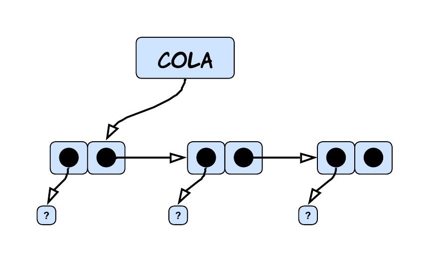

<div align="right">

</div>

# NOMBRE TP/TDA

## Repositorio de Francisco Infanti - 110822 - finfanti@fi.uba.ar

- Para compilar:

```bash
make pruebas_chanutron
```

- Para ejecutar:

```bash
./pruebas_chanutron
```

- Para ejecutar con valgrind:
```bash
make valgrind-chanutron
```
---
##  Funcionamiento

El funcionamiento del *TDA lista* consiste en crearla, utilizarla de la manera que se necesite y destruirla. La implementación que se utilizó para la lista fue la de *nodos simplemente enlazados* con una referencia al primer y último nodo. Dentro de cada nodo se almacena la dirección de memoria del nodo que le sigue, en caso de que no exista se guarda `NULL`, y el elemento que el usuario desee almacenar en la lista. En los gráficos se va a ver que los nodos están al lado de otros nodos, pero en realidad pueden estar en cualquier parte de la memoria y es por eso que guardamos la dirección de memoria del siguiente nodo.

---

<div align="center">

</div>

---

Para poder crear una lista se reserva un bloque de memoria en el heap, el cual será apuntado por el puntero `lista`. Dicho bloque guardará el número de la cantidad de elementos que se almacenan en la lista y la dirección de memoria del primer y último nodo. Veremos que teniendo un puntero al primer y último nodo mejora la complejidad de las operaciones, estamos hablando de que operaciónen que fueran `O(n)` pasan a ser `O(1)`.

---

<div align="center">

</div>

---

Una vez creada la lista, el usuario puede ingresar y eliminar elementos en cualquier posición de esta. Si el usuario quisiera ingresar un elemento en una posición inválida o borrar un elemento que no existe, el programa intentará insertar el elemento en la última posición de la lista o borrar el último elemento de la lista. El usuario puede guardar cualquier tipo de dato que quiera en los nodos, al funcionamiento del programa no le afecta que este sea un *int*, *char*, *bool*, etc... Solamente se necesita que a las funciones se les pase la dirección de memoria de ese tipo de dato.

Cada vez que queramos almacenar un elemento vamos a tener que reservar un bloque de memoria en el heap, el cual será apuntado por un puntero `nodo`. Como mencione antes, en ese bloque se guarda la dirección de memoria del elemento ingresado y la dirección de memoria del nodo que le sigue. Puede que le siga un nodo, como puede que no. Pero es muy importante que si no le sigue ninguno, que esa dirección sea `NULL`, pues sino se podría estar accediendo a un lugar de memoria que no sabemos que tiene. Cuando insertamos un elemento en una posición, dependiendo de cual sea, tendremos un proceso diferente. Estas posiciones "especiales" son la primera posición, en el medio o en el final. En la respuesta a la 2da pregunta teórica pueden verse los gráficos y explicaciones detalladas de cada uno de estos procesos. Pero en general si tuviéramos un único elemento, se vería de la siguiente forma.

---

<div align="center">

</div>

---

Para poder eliminar un elemento de una lista solamente debemos liberar el bloque de memoria donde está el elemento que queremos eliminar, para liberarlo hacemos uso del puntero `nodo` que apunta a ese bloque y la función `free()`. Pero para poder realizar esta operación con éxito y no perder ningún nodo, debemos seguir una serie de pasos. La idea general sería que deberíamos posicionarnos en el `nodo anterior` al cual queremos eliminar y guardar, en un puntero `aux`, la dirección de memoria que `nodo anterior` guarda. Esa dirección sería la del nodo siguiente, que en nuestro caso sería la dirección del nodo que almacena el elemento que queremos borrar. Antes de liberar la memoria, debemos hacer que el `nodo anterior` almacene la dirección de memoria la cual guarda el nodo que queremos borrar. Luego podemos liberar el bloque que está siendo apuntado por `aux`. También en la respuesta a la 2da pregunta teórica puede verse los gráficos detalladamente. En general con una lista con `n` elementos se vería de la siguiente forma.

---

<div align="center">

</div>

---

El usuario también puede ver cuántos elementos tiene una lista, ver si está vacía y buscar elementos en cualquier parte de la lista. Puede buscar un elemento según una posición o según una condición, ahora según dónde y cómo lo busque hay distintos procesos con distintas complejidades.
 - El caso con la mejor complejidad, `O(1)`, sería que el usuario quisiera ver el primer o último elemento de la lista. En este caso lo único que se hace es usar los punteros que tiene la lista al primer y último elemento.
 - Si el usuario quisiera buscar un elemento en la posición `n` o que cumpla la condición `x`, en el peor de los casos sería `O(n)`, pues debería recorrer todos los elementos de mi lista.
 - En el caso de que la lista esté vacía, la posición no exista o el comparador sea nulo, se devolverá directamente `NULL`. Ahora en caso de que ningún elemento cumpla la condición también se devolverá `NULL`, pero tuve que recorrer toda la lista primero.

Al usuario se le devolverá un puntero al tipo de dato que él haya ingresado, el después deberá hacer el casteo correspondiente para poder ver el valor de ese elemento.

---

<div align="center">

</div>

---

Por último el usuario tiene la posibilidad de utilizar dos iteradores, uno *externo* y uno *interno*.

- El iterador *interno* funciona usando la función `lista_con_cada_elemento()`, a esta se le deberá pasar la lista sobre la que se quiere iterar, la función la cual se le quiera aplicar a los elementos y un puntero que suele utilizarse como la memoria en común que se tiene entre el usuario y la función. En este caso la función es de tipo *bool*, por lo tanto se puede decidir cuando se termina de iterar. Al finalizar la función se devolverá la cantidad de elementos a los cuales se le aplicó la función.

- El iterador *externo* sería un conjunto de funciones que le permiten al usuario iterar una lista sin conocer cómo está implementada. El itera como si estuviera iterando un vector. Lo primero que se debería hacer es crear un iterador externo, para eso se reserva un bloque de memoria en el heap, el cual será apuntado por el puntero `iterador`. En dicho bloque se almacena la dirección de memoria de la lista y la dirección de memoria del primer nodo de la lista. Luego una vez creada la lista ya se está apuntando al primer elemento. En caso de que no exista una lista (no tendría sentido crear el iterador), se devolverá `NULL`. Una vez tenemos creado el iterador, podemos hacer tres cosas.

  - Verificar si seguimos teniendo elementos para iterar, es decir, si el `nodo actual` guarda la dirección de memoria de algún nodo. Por este motivo es por el cual mencione antes que es importante que si a un nodo no lo sigue otro, entonces que apunte a `NULL`, sino en este caso estaríamos diciendo que si tiene un siguiente cuando en realidad no es cierto.

  - Mostrar el elemento del nodo actual, en este caso lo único que se hace es devolver la dirección de memoria de donde está el elemento. Claramente si el nodo es `NULL`, se devolverá `NULL`, pero no hay problema si el elemento que está guardado en esa dirección de memoria es `NULL`.

  - Lo último sería lo principal de la iteración, que es avanzar de elemento. Esto le permite al usuario que la dirección de memoria que hace referencia al nodo, pase al siguiente nodo. Es decir, si el `nodo actual` apuntaba al primer nodo y ese tiene siguiente, ahora `nodo actual` apunta al siguiente del primer nodo. En el caso de que el primer nodo no tenga siguiente, se avanza el iterador igualmente. Si se puede avanzar exitosamente, se devolverá *true*, pero en caso de que se avance y el `nodo actual` sea `NULL`, se devuelve *false*. También en el caso de que falle algo se devuelve *false*.

- También es muy importante que una vez que se termina de usar el iterador externo, debemos liberar la memoria que este ocupaba en memoria. Pero solamente la del iterador, la de la lista se elimina una vez se quiera dejar de utilizar el programa.

---

<div align="center">

</div>

---

Finalmente, una vez que queramos dejar de usar el programa, debemos liberar toda la memoria utilizada por la lista. Hay dos formas "diferentes" de eliminar una lista. La primera será aplicar la función `lista_destruir()` la cual solamente libera la memoria de la lista y la otra sería aplicar `lista_destruir_todo()` la cual antes de eliminar la lista le aplica una función a cada elemento de esta. Las funciones hacen exactamente lo mismo, porque en el caso de que la función pasada por parámetro sea `NULL`, se va a seguir liberando la memoria de la listas como si fuera la función `lista_destruir()`. La forma en la que se destruiría sería ir nodo por nodo, usando un `aux`, y liberando la memoria hasta que solamente quede el bloque apuntado por `lista`.

---

<div align="center">

</div>

---

Finalmente se liberaría el bloque apuntado por `lista`.

---

<div align="center">

</div>

---

También se implementaron otros dos TDA, el de *pila* y *cola*. Ambos TDA utilizan las funciones de *lista*, pero tienen algunas restricciones. En ambos casos se siguió utilizando la implementación de *nodos simplemente enlazados* con una referencia al primer y último nodo. Para no repetir codigo lo que se hizo fue que las estrcuturas de ambos TDA sea igual al de lista, entonces de esta manera podremos reutilizar todas las funciones del TDA lista, la unica complejidad seria que debemos castear los datos. Pero este problema se resuelve facilmente utilizando los `void*`.

En el caso de la *pila*, esta también se debe crear reservando un bloque de memoria en el heap, el cual será apuntado por el puntero `pila`. Dentro de este bloque se guardarán los mismos datos que se guardaban en el de la lista. 

---

<div align="center">

</div>

---

Una diferencia fundamental, en comparación con el TDA lista, es que en este caso solamente podemos insertar, eliminar y ver el elemento que se encuentra en la posición del tope de la pila. La idea es la misma que en la lista, se recibe un elemento que se quiere insertar, entonces se crea un nodo y se lo inserta en la última posición. Para el caso de eliminar voy a tener que liberar la memoria que me ocupa el nodo que se encuentra en el tope de la pila.

---

<div align="center">

</div>

---

Si quisiera ver un elemento de la pila, solamente tenemos acceso al que se encuentra en la poscion del tope. A su vez, también podemos hacer operaciones como chequear si está vacía o ver la cantidad de elementos que tiene. 

Por último y muy importante es que debemos liberar toda la memoria utilizada por la pila. El proceso para eliminar es el mismo que el de lista y pila, solamente que en este caso no es necesario aplicarle una función a los elementos.

---

<div align="center">

</div>

---

En el caso de la *cola* también debemos reservar un bloque de memoria en el heap, este será apuntado por el puntero `cola`. Dicho bloque guardará lo mismo que el de pila y lista.

---

<div align="center">

</div>

---

Una diferencia con respecto al TDA de lista y pila, es que en este caso solamente podemos insertar elementos en la última posición de la cola. El proceso sigue siendo el mismo, creamos un nodo con la dirección de memoria del elemento que se quiere insertar y se lo inserta en la última posición. 

En cuanto a eliminar, solamente podemos eliminar el elemento de la primera posición de la cola. Tambien el proceso sigue siendo el mismo que el de querer eliminar un elemento en la lista. 

Y por último, si queremos ver un elemento, solamente tenemos acceso al elemento que se encuentra en la primera posición de la cola. Y para mostrarlo podemos usar el puntero al primer elemento.

---

<div align="center">

</div>

---

También siguen estando las operaciones de ver si la cola está vacía y ver la cantidad de elementos tenemos en esta. A su vez, cuando terminemos de utilizar el programa debemos liberar toda la memoria utilizada. El proceso de eliminar es el mismo que el de lista, solamente que no hace falta aplicarle una función a los elementos de esta.

---

<div align="center">

</div>

---

Por último quiero mencionar que para poder recorrer todos los nodos, utilizó una función privada `recorrer_hasta_posicion()`. La cual me permite recorrer los nodos hasta la posición que yo quiera, claramente esa posición existe. La lógica consiste en que me posiciono en el primer nodo y voy avanzando de la siguiente forma:
 - `nodo actual` sería igual al primer nodo, si ese nodo está en la posición que busco, entonces lo devuelvo. Caso contrario hago que `nodo actual` apunte al siguiente de `nodo actual`. Y si es el elemento en la posición que busco lo devuelvo, sino repito el proceso hasta llegar a la posición indicada. (Cuando hablo de devolver, me refiero a un puntero a ese bloque que estaba buscando).

Esta función es muy útil a la hora de querer insertar, eliminar y buscar un elemento.

## Respuestas a las preguntas teóricas 

**1.** Una Lista, Pila y Cola son tipos de datos abstractos (TDA), los cuales nos permiten almacenar elementos de cualquier tipo de dato. Cada uno de estos TDA tienen un conjunto mínimo de operaciones, los cuales son los siguientes: *crear*, *destruir*, *insertar*, *eliminar*, *vacía* y *ver elemento*.

Las operaciones de *crear*, *destruir* y *vacía* funcionan de la misma manera en los tres TDA. La función que cumplen es crear, destruir y determinar si tiene elementos una lista, cola o pila. Las que valen la pena hacer hincapié en cada TDA son la de *insertar*, *eliminar* y *ver elemento*, pues estas si son diferentes en cada uno.

**LISTA**: Para este TDA, se puede utilizar la implementación de lista simplemente enlazada con una referencia al primer elemento y al último nodo.

---

<div align="center">

</div>

---

- La operación de *insertar* no tiene ninguna restricción, el usuario puede insertar un elemento en cualquier parte de la lista, si es que esta posición existe. A la hora de insertar un elemento pueden darse tres situaciones.

  - *1)* Insertar un elemento en la primera posición de mi lista.

  - *2)* Insertar un elemento en la última posición de mi lista.

  - *3)* Insertar el elemento en una posición `n`.

- Para la operación de *eliminar* tampoco nos encontramos con alguna restricción, el usuario puede eliminar elementos de cualquier posición, también si es que dicha posición existe. En esta también se pueden dar tres situaciones.

  - *1)* Eliminar el elemento que está en la primera posición. 

  - *2)* Eliminar el elemento que se encuentra en la última posición.

  - *3)* Eliminar el elemento en una posicion `n`.

- Por último para la operación de *ver elemento*, el usuario puede ver cualquier elemento que se encuentre en la lista.

**PILA**: Para este TDA ya empiezan a haber una serie de restricciones a la hora de usarlo. Primero de todo, para poder implementarlo conviene utilizar nodos simplemente enlazada con una referencia al último elemento de la pila.

---

<div align="center">

</div>

---

Una pila almacena elementos "apilados uno arriba de otro". Es decir se lo puede pensar como una pila de ropa, donde uno siempre deja una nueva prenda encima de la anterior. Se dice que este TDA sigue una estructura de **L.I.F.O** (Last In, First Out), esta consiste en que el último elemento que agrego va a ser el primero en salir.

- La operación de *insertar*, también llamada *apilar* o *push*, se comporta de la forma mencionada anteriormente. El usuario solamente va a poder insertar elementos en la última posición, también conocida como *tope*.

- En cuanto a la operación de *eliminar*, también conocido como *desapilar* o *pop*, el usuario solamente va a poder eliminar el elemento que se encuentra en la posición del tope.

- Por último para la operación de *ver elemento*, el usuario solamente tiene acceso al elemento que se encuentra en la posición del tope.

**COLA**: Para este TDA también existen ciertas restricciones a la hora de usarlo. En este caso conviene tener una implementación de nodos simplemente enlazados, en la cual la cola tiene una referencia al primer elemento.

---

<div align="center">

</div>

---

Como los TDA anteriores, una cola lo que hace es almacenar elementos, pero en este caso "los pone uno atrás del otro". Este TDA tiene una estructura llamada **F.I.F.O** (First In, First Out), la cual consiste en que el primer elemento que ingresamos, será el primero en salir. Por eso se lo puede pensar como una cola de autos donde el primer auto que ingresa es el primero en salir.

- La operación de *insertar*, también conocida como *encolar* o *enqueue*, consiste en que el usuario solamente puede ingresar elementos en la última posición de la cola.

- La operación de *eliminar*, también conocida como *desencolar* o *dequeue*, consiste en que el usuario únicamente puede eliminar el elemento que se encuentra en la primera posición de la cola.

- Por último la operación de *ver elemento*, consiste en que el usuario solamente puede ver el elemento que está en la primera posición.

**2.** Hay distintas formas de poder implementar el TDA de lista, en este caso voy a comparar tres diferentes implementaciones: lista *simplemente enlazada*, *doblemente enlazada* y *vector dinámico*. Para cada una de estas implementaciones voy a analizar cómo se inserta, obtiene y elimina un elemento en diferentes posiciones. En el caso de las listas enlazadas, vamos a tener un puntero al primer elemento y al ultimo de la lista.

Antes de empezar a explicar las operaciones, voy a mencionar por encima como funciona cada implementación. El *vector dinámico* consiste en tener un vector de un tamaño no fijo, el cual puedo ir agrandando o reduciendo a medida que se insertan o eliminan elementos. La lista *simplemente enlazada* y *doblemente enlazada* consisten en utilizar un TDA llamado nodos, estos almacenan un elemento `(void*)` y la dirección de memoria del nodo que le sigue (en el caso de la doblemente enlazada tengo la direccion del anterior y el siguiente), pues los nodos funcionan como una especie de vector dinámico, el cual nos permite almacenar elementos sin necesidad de tener bloques contiguos de memoria libre.

La forma la cual tendrán estas implementaciones sería la siguiente:

---

<div align="center">

</div>

---

Si queremos insertar, eliminar o ver un elemento en una lista, se pueden dar 3 casos diferentes:

- El primero sería insertar un elemento en la primera posición de nuestra lista. En el caso de la lista *simplemente enlazada* lo que debemos hacer es usar el puntero `nodo_inicio` para hacer que `nodo_nuevo` apunte a `nodo_primero`, luego `nodo_inicio` debe apuntar a `nuevo_nodo`. Para la *doblemente enlazada* se realiza una operación similar, con la única diferencia de que `nodo_primero` apunta a `nodo_nuevo`. La complejidad de estos casos es `O(1)`, pues lo único que estamos haciendo son operaciones simples, como asignar nuevas direcciones de memoria a punteros. En cuanto al caso del *vector dinámico* lo que debemos hacer, en el peor de los casos, es agrandar el bloque de memoria usando `realloc()`. Por lo tanto estamos realizando una operación `O(n)`. Además debemos correr todos los elementos un lugar a la derecha a partir de la primera posición para así poder "dejarle el lugar" al nuevo elemento, otra operación `O(n)`. Pero finalmente la complejidad total de insertar seria `O(n)`, pues terminaria siendo una suma de operaciones `O(n)`. Aun asi, veamos que es peor a la implementación de *simplemente enlazada* y  *doblemente enlazada*.

---

<div align="center">

</div>

---

- En cuanto a querer eliminar un elemento, en la lista *simplemente enlazada* usamos el puntero `nodo_inicio` para acceder a `nodo_eliminar`, que vendria a ser el primer elemento. Luego hacemos que `nodo_inicio` apunte al siguiente de `nodo_eliminar`. En el caso de la *doblemente enlazada* también es muy similar el proceso, solo que el nodo siguiente a `nodo_eliminar` que estaba apuntando a `nodo_eliminar`, debe apuntar a `NULL`. En ambas implementaciones la complejidad total seria `O(1)`, pues solamente estamos haciendo operaciones simples. Ahora en el caso de la implementación de *vector dinámico*, lo que deberíamos hacer es eliminar el elemento que está en la primera posición pisandolo con esta en la segunda posicion, a este tambien lo debemos pisar con el que esta en la tercera. Luego debemos mover todos los elementos restantes un lugar a la izquierda. A su vez nuevamente debemos usar `realloc()`. Por lo tanto la complejidad de toda esta operación es `O(n)`, luego veamos que también es peor en comparación con la implementación de nodos.

---

<div align="center">

</div>

---

- Por último, si queremos ver un elemento en la primera posición, para todas las implementaciones la complejidad es `O(1)`. Pues lo único que debemos hacer acceder a la dirección de memoria del primer elemento, de esta en los tres casos tenemos una puntero directo. En el caso de los nodos `nodo_inicio` y en el del vector solo basta con hacer `vector[0]`.

- El segundo caso sería querer insertar un elemento en la posición `n`. En la lista *simplemente enlazada* lo que debemos hacer es recorrer los nodos hasta llegar a `n-1`, sería el anterior a donde queremos insertar. Ahora `nodo_nuevo` debe apuntar a donde está apuntando `nodo_anterior` y `nodo_anterior` debe apuntar a `nodo_nuevo`. En la lista *doblemente enlazada* también es muy similar el proceso, la única diferencia es que ahora debemos hacer que `nuevo_nodo` apunte a `nodo_anterior`, `nodo_siguiente`, y viceversa. Veamos que para esta implementación la complejidad es `O(n)`, pues debemos recorrer hasta la posición `n-1` y hacer algunas operaciones simples que no aportan al tamaño del problema. Para el *vector dinámico* debemos agrandar nuevamente el bloque de memoria con `realloc()` y mover todos los elementos un lugar a la derecha a partir la posición `n`, para así poder insertar el nuevo elemento. Por lo tanto en este caso también la complejidad sería `O(n)`, pero si lo comparamos con la  implementación de nodos esta resulta ser peor, pues realizamos dos operaciones de `O(n)`.

---

<div align="center">

</div>

---

- Para eliminar un elemento en la posición `n`, en la lista *simplemente enlazada* debemos recorrer hasta el `nodo_anterior` a la posicion donde queremos eliminar, es decir, `n-1`. Luego un puntero `aux` debe apuntar al siguiente de `nodo_anterior`, es decir, a `nodo_eliminar`. Antes de eliminarlo debemos hacer que `nodo_anterior` apunte a donde esta apuntado `nodo_eliminar`. En la lista *doblemente enlazada* debemos hacer lo mismo solo que ahora recorremos hasta la posición `n` y usando los punteros al anterior y al siguiente que tiene `nodo_eliminar`, hacemos que los nodos que tiene a su lado se apunten entre sí. Luego podemos eliminar el `nodo_eliminar` sin perder ningun nodo. Notemos que no hizo falta nigun puntero `aux` para la lista *doblemente enlazada*. Tambien veamos que para ambos casos la operación es `O(n)`, pues en el peor de los casos recorremos hasta la `n` / `n-1` posición de la lista. Ahora viendo el caso del *vector dinámico* lo que habría que hacer es recorrer hasta la posición `n` y pisarla con el elemento de la posición `n+1` y a `n+1` lo pisamos con `n+2`. Luego debemos mover todos los elementos a una posición a la izquierda y por último usar `realloc()`. Luego la complejidad de la operación es `O(n)`. Entonces si lo comparamos con las implementaciones de nodos esta es peor porque debemos recorrer el vector dos veces, aunque ambas por separado.

---

<div align="center">

</div>

---

- Si queremos ver un elemento en la posición del medio, en todos los casos de lista enlazada debemos recorrer hasta la posición `n`. Así que la complejidad para estos sería `O(n)`. Pero en el caso del *vector dinamico*, seria `O(1)`, pues podemos ir derectamente a la posicion `n` del vector y devolver el elemento, esto en el caso de que me digan la posicion del elemento. Si me piden buscar el elemento, entonces seria `O(n)`, pues no se donde esta.

- El último caso consiste en querer insertar un elemento en la última posición. En la lista *simplemente enlazada* lo que debemos hacer es utilizar el puntero `nodo_fin` para poder ir hasta la última posición de nuestra lista y hacer que el `nodo_ultimo` apunte a `nuevo_nodo` y luego hacemos que `nodo_fin` apunte a `nuevo_nodo`. Ahora con la lista *doblemente enlazada* el proceso es el mismo solo que ahora `nuevo_nodo` debe apuntar a `nodo_utlimo`. Observemos que la complejidad vuelve a ser `O(1)`, pues solo estamos haciendo operaciones simples. Por último usando el *vector dinámico*, debemos agrandar el bloque de memoria usando `realloc()` y después ir hasta la última posición del vector e insertar el elemento. Entonces en este caso la complejidad sigue siendo `O(n)` (por el uso del `realloc()`) la cual es peor a las dos implementaciones previas.

---

<div align="center">

</div>

---

- Si queremos eliminar un elemento de la posición del final, en la lista *simplemente enlazada* debemos recorrer hasta el `nodo_anterior`, que seria la posicion `n-1`. Y hacer que un puntero `aux` apunte a `nodo_ultimo`. Luego modificamos que `nodo_anterior` apunte a `NULL` y después `nodo_fin` apunte al nuevo último nodo. Ahora para la lista *doblemente enlazada* solamente usamos el puntero `nodo_fin` para acceder al `nodo_ultimo` y usando el puntero que tiene este al `nodo_anterior`, hacemos que `nodo_fin` apunte a `nodo_anterior`. En este caso si hay una diferencia de complejidad entre las implementaciones con nodos, pues para la *simplemente enlazada* la complejidad es `O(n)`, mientras que para la *doblemente enlazada* es `O(1)`. Para la implementación de *vector dinámico* usamos directamente `realloc()`. Luego en este caso la complejidad sería `O(n)`, únicamente por haber usado `realloc()`. Veamos que la mejor implementación en este caso sería la lista *doblemente enlazada* y la de *vector dinámico* tiene la misma complejidad que *simplemente enlazada*.

---

<div align="center">

</div>

---

- Por último si queremos ver un elemento en la última posición, también sería como verlo en la primera, lo único que debemos hacer es ir hasta esa posición, con una referencia directa, y mostrar el elemento. Es decir, tiene una complejidad `O(1)` para las tres implementaciones.

**3.** Empezando por la primera operación, que vendría a ser crear una *cola* o *pila*, vemos que lo que debemos hacer es reservar un bloque de memoria en el heap de un tamaño adecuado y devolver la dirección de memoria de ese bloque. Claramente esto es una operación `O(1)`, pues al estar utilizando la función `calloc()`, solamente se está reservando un bloque e inicializando todo los campos en cero.

Ahora analizaremos la complejidad para insertar un elemento. Como la posición para insertar un elemento es la misma para ambos TDA, podemos hacer el análisis de complejidad a la vez.
- Como sabemos, en el TDA de *pila* y *cola*, nosotros solamente podemos insertar un elemento en la última posición. Para poder realizar este proceso se utiliza la función `lista_insertar()`, en dicha función lo que se hace es usar el puntero `nodo_fin` para ir directamente a la última posición. Una vez estemos en dicha posición, hacemos que `nodo_ultimo` apunte a `nodo_nuevo`, a su vez también `nodo_fin` debe apuntar a `nodo_nuevo`. Veamos que estas son operaciones simples, es decir, tiene una complejidad constante `O(1)`.

Para el caso de querer eliminar un elemento, vemos que para cada TDA se hace en dos posiciones diferentes. Por lo tanto, nos conviene hacer el análisis por separado.
- Para el caso del TDA *pila*, sabemos que solamente podemos desapilar el elemento de la última posición. Luego el proceso consiste en utilizar la función `lista_quitar()`. En dicha función lo que se hace es utilizar el puntero `nodo_fin` para ir directamente hasta la última posición de la pila, una vez estemos en esa posición se elimina el elemento utilizando la función `free()`, es decir, hacemos una operación `O(1)`. También debemos hacer que `nodo_fin` apunte a la nueva última posición, entonces debemos recorrer la pila hasta la nueva última posición y hacer que `nodo_fin` apunte a ese nodo. En este caso esta operación sería `O(n)`. Pero en si la operación de desapilar un elemento es constante, pues para `n` elementos solamente debemos ir hasta la última posición y eliminar el último elemento.

- Para el caso del TDA *cola*, también sabemos que solamente podemos desencolar el elemento de la primera posición. En este caso lo que se hace es hacer uso de la función `lista_quitar_de_posicion`, la cual recibiría la pila y una posición. En este caso esa posición sería siempre la misma, que vendría a ser la posición cero. Lo que se hace dentro de esta función es utilizar el puntero `nodo_inicio` para ir hasta la primera posición y apuntar a ese nodo con un puntero `aux`. Una vez que lo tengamos apuntado, hacemos que el `nodo_inicio` apunte al siguiente del que queremos eliminar, luego utilizando la función `free()` liberamos el nodo. Como podemos observar esta operación es de complejidad constante `O(1)`, pues estamos haciendo operaciones simples y constantes.

Analizando el caso de ver un elemento, sabemos que en el TDA de *pila* solamente podemos ver el elemento de la posición del tope y en el caso del TDA *cola* solamente el de la primera posición. En ambos TDA la complejidad es `O(1)`, pues utilizando los punteros al primer y último elemento, podemos ir directamente a esos nodos y devolver la dirección de memoria del elemento. También para el caso de ver si la *pila* o *cola* está vacía o ver la cantidad de elementos que tienen, la complejidad es `O(1)`. Pues lo único que hacemos es verificar un valor de una estructura sobre la cual tenemos un puntero directo.

El último caso consiste en querer destruir una *pila* o *cola*. En este caso es inevitable hacer una operación con complejidad `O(n)`, que vendría a ser recorrer nodo por nodo e ir liberando la memoria que ocupan. Para ambos casos se utiliza la función `lista_destruir()`.