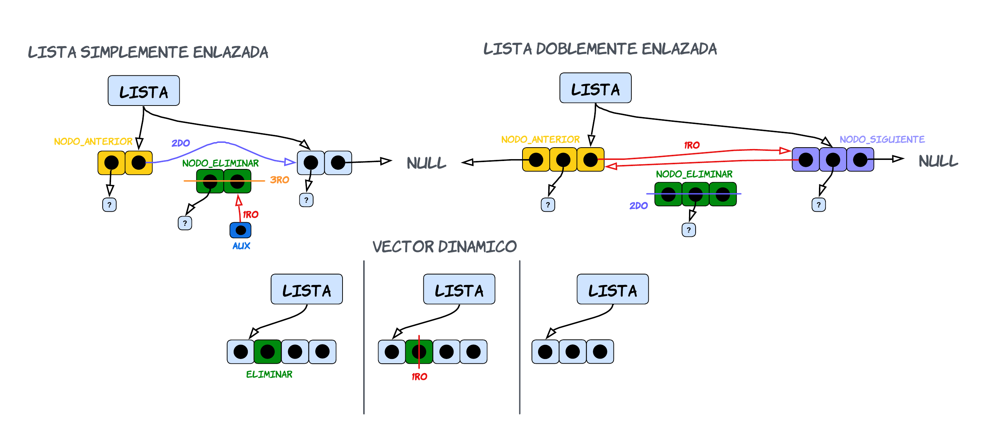

<div align="right">

</div>

# NOMBRE TP/TDA

## Repositorio de Francisco Infanti - 110822 - finfanti@fi.uba.ar

- Para compilar:

```bash
make pruebas_chanutron
```

- Para ejecutar:

```bash
./pruebas_chanutron
```

- Para ejecutar con valgrind:
```bash
make valgrind-chanutron
```
---
##  Funcionamiento

## Respuestas a las preguntas teóricas 

**1.** Una Lista, Pila y Cola son tipos de datos abstractos (TDA), los cuales nos permiten almacenar elementos de cualquier tipo de dato. Cada uno de estos TDA tienen un conjunto mínimo de operaciones. Algunas de estas operaciones son similares entre los TDA y otras no tanto. El conjunto mínimo de operaciones son los siguientes: **crear**, **destruir**, **insertar**, **eliminar**, **vacía** y **ver elemento**.

Las operaciones de **crear**, **destruir** y **vacía**, funcionan de la misma manera en los 3 TDA. La funcion que cumplen es crear, destruir y determinar si tiene elementos un TDA. Las que valen la pena hacer hincapié en cada TDA son la de **insertar**, **eliminar** y **ver elemento**, pues estas si son diferentes en cada uno.

**LISTA**: Para este TDA, se puede utilizar la implementacion de lista simplemente enlzada con una referencia al primer elemento y al utlimo. 

 - La operacion de **insertar** no tiene niguna restriccion yo puedo insertar un elemento en cualquier parte de mi lista, si es que esta posicion existe. A la hora de insertar un elemento pueden darse 3 casos diferentes. 

**1)** El primer caso consiste en querer insertar un elemento en la primera posicion de mi lista.  

**2)** El segundo caso consiste en insertar un elemento en la ultima posicion de mi lista. 

**3)** El ultimo caso consiste en querer insertar el elemento en una poscion aleatoria, puede ser en la primera, el medio o en el final.

---

<div align="center">

</div>

---

 - Para la operacion de **eliminar** tampoco nos encontramos con alguna restriccion. Para esta operacion, tambien se pueden dar 3 casos diferentes.

**1)** El primer caso consiste en querer eliminar el elemento que esta en la primera posicion.

**2)** El segundo caso consiste en querer eliminar el elemento que se encuentra en una posicion aleatoria, puede ser la primera, una cualquiera o la ultima.

**3)** Por ultimo el tercer caso consiste en querer eliminar el elemento que se encuentra en la ultima posicion.

---

<div align="center">

</div>

---

 - Por ultimo para la operacion de **ver elemento**, el usuario puede ver cualquier elemento que se encuentre en la lista.

**PILA**: Para este TDA ya empiezan a haber una serie de restricciones a la hora de usarlo. Primero de todo, para poder implementarlo conviene utilizar una referencia al ultimo elemento en vez de el primero.

Una pila almacena elementos "apilandolos uno arriba de otro". Es decir se lo puede pensar como una pila de ropa, donde uno siempre deja una nueva prenda encima de la anterior. Se dice que este TDA sigue una estructura de **L.I.F.O** (Last In, First Out), esta consiste en que el ultimo elemento que agrego va a ser el primero en salir.

 - La operacion de **insertar**, tambien llamada **apilar** o **push**, se comporta de la forma mencionada anteriormente. El usuario solamente va a poder insertar elementos en la ultima posicion, tambien conocida como **tope**. 

---

<div align="center">

</div>

---

 - En cuanto a la operacion de **eliminar**, tambien conocido como **desapilar** o **pop**, el usuario solamente va a poder eliminar el elemento que se encuentra en la posicion del tope.
---

<div align="center">

</div>

---

 - Por ultimo para la operacion de **ver elemento**, el usuario solamente tiene acceso al elemento que se encuentra en la posicion del tope.

**COLA**: Para este TDA tambien existen ciertas restricciones a la hora de usarlo. En este caso conviene tener una implementacion de nodos simplemente enlazados, en la cual la lista tiene una referencia al primer elemento y al utlimo.

Como los TDA anteriores, una cola lo que hace es almacenar elementos, pero en este caso "los pone uno atras del otro". Este TDA tiene una estructura llamada **F.I.F.O** (First In, First Out), la cual consiste en que el primer elemento que ingresamos, sera el primero en salir. Por eso se lo puede pensar como una cola de autos donde el primer auto que ingresa es el primero en salir.

 - La operacion de **insertar**, tambien conocida como **encolar** o **enqueue**, consiste en que el usuario solamente puede ingresar elementos en la ultima posicion de la cola.

---

<div align="center">

</div>

---

 - La operacion de **eliminar**, tambien conocida como **desencolar** o **dequeue**, consiste en que el usuario unicamente puede eliminar el elemento que se enecuentra en la primera posicion de la cola.

---

<div align="center">

</div>

---

 - Por ultimo la operacion de **ver elemento**, consiste en que el usuario solamente puede ver el elemento que esta en la primera posicion.

**2.** Hay distintas formas de poder implementar el TDA de lista, en este caso voy a comparar tres diferentes implementaciones: lista *simplemente enlazada*, *doblemente enlazada* y *vector dinamico*. Para cada una de estas implementaciones voy a analizar como se inserta, obtiene y elimina un elemento en diferentes posiciones.

Antes de empezar a explicar las operaciones, voy a mencionar por encima como funciona cada implementacion. El *vector dinamico* consiste en tener un vector de un tamaño no fijo, el cual puedo ir agrandando o reduciendo a medida que se insertan o eliminan elementos. La lista *simplemente enlazada* y *doblemente enlazada* consisten en utilizar un TDA llamado nodos. Los nodos almacenan dos cosas, un elemento `(void*)` y la direccion de memoria del nodo que le sigue (en el caso de la doblemente enlazada tengo la direccion del anterior y el siguiente), pues los nodos funcionan como una especie de vector dinamico, el cual nos permite almacenar elementos sin necesidad de tener bloques contiguos de memoria libre. 
La forma la cual tendran estas implementaciones seria la siguiente:

---

<div align="center">

</div>

---

Si queremos insertar, eliminar o ver un elemento en una lista, se pueden dar 3 casos diferentes:

- El primero seria insertar un elemento en la primera posicion de nuestra lista. En el caso de la lista *simplemente enlazada* lo que debemos hacer es usar la referencia de `nodo_inicio` para hacer que `nodo_nuevo` apunte a donde estaba apuntando `nodo_inicio`, luego `nodo_inicio` debe apuntar a `nuevo_nodo`. Para la *doblemente enlazada* se realiza una operacion similar, con la unica diferencia de que `nodo_primero` apunta a `nodo_nuevo`. La complejidad de estos casos es `O(1)`, pues lo unico que estamos haciendo son operaciones simples, como asignar nuevas direcciones de memoria a punteros. En cuanto al caso del *vector dinamico* lo que debemos hacer, en el peor de los casos, es agrandar el bloque de memoria usando `realloc()`. Por lo tanto estamos realizando una operacion de `O(n)`. Ademas debemos correr todos los elementos un lugar a la derecha, a partir de la primera posicion, para asi poder "dejarle el lugar" al nuevo elemento (otra operacion `O(n)`). Pero finalmente la complejidad total de insertar seria `O(n)`, la cual es peor a la de la implentacion de *simplemente enlazada* y  *doblemente enlazada*.

---

<div align="center">

</div>

---

- En cuanto a querer eliminar un elemento, en la lista *simplemente enlazada*, usamos la referencia que tiene `nodo_inicio` al `nodo_primero` y hacemos que un puntero `aux` apunte a `nodo_primero`. Luego `nodo_primero` debe apuntar al siguiente de `nodo_inicio`. En el caso de la *doblemente enlazada* tambien es muy similar el proceso, solo que ahora no necesitamos usar un `aux`, directamente accedemos a `nodo_eliminar` y hacemos que `nodo_inicio` apunte a `nodo_primero`, luego `nodo_primero` apunta a `NULL`.En ambas implementaciones la complejidad total seria `O(1)`, pues solamente estamos haciendo operaciones simples. Ahora en el caso de la implementacion de *vector dinamico*, lo que deberiamos hacer es eliminar el elemento que esta en la primera posicion y luego mover todos los elementos restantes un lugar a la izquierda. Tambien nuevamente debemos usar `realloc()`. Por lo tanto la complejidad de toda esta operacion es `O(n)`, luego veamos que tambien es peor en comparacion con la implementacion de nodos.

---

<div align="center">

</div>

---

- Por ultimo, si queremos ver un elemento en la primera posicion. Para todas las implementaciones la complejidad es `O(1)`, pues lo unico que debemos hacer es ir a una direccion de memoria del primer elemento, de esta en los tres casos tenemos una referencia directa.
  
- El segundo caso seria querer insertar un elemento en la posicion `n`. En la lista *simplemene enlazada* lo que debemos hacer es recorrer los nodos hasta llegar a `n-1`, seria el anterior a donde queremos insertar. Ahora`nodo_nuevo` debe apuntar a donde esta apuntando `nodo_anterior`, y `nodo_anterior` debe apuntar a `nodo_nuevo`. En la lista *doblemente enlazada* tambien es muy similar el proceso, la unica diferencia es que ahora debemos hacer que `nuevo_nodo` apunte a `nodo_anterior` y`nodo_siguiente`, y viceversa. Veamos que para esta implementacion la complejidad `O(n)`, pues debemos recorrer hasta la posicion `n-1` y hacer algunas operaciones simples que no aportan al tamaño del problema. Por ultimo para el *vector dinamico* debemos agrandar nuevamente el bloque de memoria con `realloc()` y mover todos los elementos un lugar a la derecha, a partir la posicion `n`, para asi poder insertar el nuevo elemento. Por lo tanto en este caso tambien la complejidad seria `O(n)`, pero si lo comparamos con la  implementacion de nodos esta resulta ser peor, pues realizamos 3 operaciones de `O(n)`.

---

<div align="center">

</div>

---

- Para eliminar un elemento en la posicion `n`, en la lista *simplemente enlazada* debemos recorrer hasta `n-1` y usar `nodo_aneterior` para que un `aux` apunte a `nodo_eliminar`. Antes de eliminarlo debemos hacer que `nodo_anterior` apunte a donde estaba apuntado `nodo_eliminar`. En la lista *doblemente enlazada* debemos hacer lo mismo solo que ahora recorremos hasta la posicion `n` y usando las referencias que tiene `nodo_eliminar` para que los nodos que tiene a su lado se apunten entre si. Veamos que para ambos casos la operacion es `O(n)`, pues en el peor de los casos recorremos hasta la `n`, `n-1` poscion de la lista. Ahora viendo el caso del *vector dinamico* lo que habria que hacer es recorrer hasta la posicion `n` y pisarla con el elemento de la posicion `n+1` y asi a `n+1` lo pisamos con `n+2`. Luego debemos mover todos los elementos una posicion a la izquierda y por ultimo usar `realloc()`. Pero aun asi, veamos que la operacion es `O(n)`, pero si lo comparamos con las implementaciones de nodos esta es peor porque debemos recorrer el vector dos veces, aunque ambas por separado.

---

<div align="center">

</div>

---

- Si queremos ver un elemento en la posicion del medio, en todos los casos debemos recorrer hasta la posicion `n`. Asi que la complejidad para todos seria `O(n)`. 

- El ultimo caso consiste en querer insertar un elemento en la ultima posicion de la lista. En la lista *simplemente enlazada* lo que debemos hacer es utilizar la referencia de `nodo_fin` para poder ir hasta la ultima posicion de nuestra lista y hacer que el `nodo_ultimo` apunte a `nuevo_nodo` y luego hacemos que `nodo_fin` apunte a `nuevo_nodo`. Ahora con la lista *doblemente enlazada* el proceso es el mismo solo que ahora `nuevo_nodo` debe apuntar a `nodo_utlimo`. Observemos que la complejidad vuele a ser `O(1)`, pues solo estamos haciendo operaciones simples. Por ultimo usando el *vector dinamico*, debemos agrandar el bloque de memoria usando `realloc()` y despues recorrer todo el vector hasta la ultima posicion e insertar el elemento. Entonces en este caso la complejidad sigue siendo `O(n)`, la cual es peor a las dos implementaciones previas.

---

<div align="center">

</div>

---

- Si queremos eliminar un elemento de la posisicon del final, en la lista *simplemente enlazada* debemos recorrer hasta la posicion `n-1`, `nodo_anterior`, y hacer que un puntero `aux` apunte a `nodo_ultimo`. Luego modificamos que `nodo_anterio` apunte a `NULL` y hacemos despues debemos recorrer todos los nodos hasta el ultimo, para que `nodo_fin` apunte al nuevo ultimo nodo. Ahora para la lista *doblemente enlazada* solamente usamos la referencia de `nodo_fin` al `nodo_ultimo` y usando la referencia que tiene este al `nodo_anterior`, hacemos que `nodo_fin` apunte a `nodo_anterior`. En este caso si hay una diferencia de complejidad entre las implementaciones con nodos, pues para la *simplemente enlazada* la complejidad es `O(n)`, mientras que para la *doblemente enlazada* es `O(1)`. Para la implementacion de *vector dinamico* usamos directamente `realloc()`. Luego en este caso la complejidad seria `O(n)`, unicamente por haber usado `realloc()`. Veamos que la mejor implementacion en este caso seria la lista *doblemente enlazada*, y la de *vector dinamico* tiene la misma complejidad que *simplemente enlazada*.

---

<div align="center">

</div>

---

- Por ultimo si queremos ver un elemento en la ultima posicion, tambien seria como verlo en la primera, lo unico que debemos hacer es ir hasta esa posicion, con una referencia directa, y mostrar el elemento. Es decir, tiene una complejidad `O(1)` para las tres implementaciones.